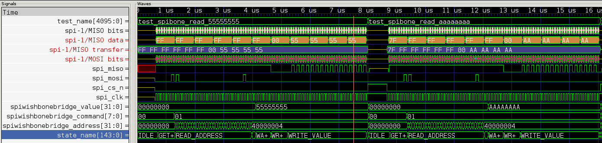

# Spibone Simulator

This directory contains everything necessary to simulate spibone.  Simulation is critical for proving a design.

## Requirements

To simulate, you need `iverilog` and `cocotb`.  To view the output, you need `gtkwave` and, optionally, `sigrok-cli`.

| Tool        | Purpose           |
| ----------- |------------------ |
| **[iverilog](http://iverilog.icarus.com/)** | Verilog simulator |
| **[cocotb](https://github.com/cocotb/cocotb/)** | Allows us to drive `iverilog` with Python |
| **[gtkwave](http://gtkwave.sourceforge.net/)** | Display VCD waveform files |
| **[sigrok-cli](https://sigrok.org/wiki/Sigrok-cli)** | Decode SPI signals in `gtkwave` |

## Running the Simulator

To run the simulator, type `make`.  To run only certain testcases, type `make TESTCASE=[list-of-testcases]`.  For example, `make TESTCASE=test_wishbone_write` or `make TESTCASE=test_spibone_read_aaaaaaaa,test_spibone_read_55555555`.

## Using gtkwave

If you have `gtkwave`, you can view the output.  If you have `sigrok-cli`, you can even get decoded output of SPI.

To run `gtkwave` with the Sigrok decoder, run `gtkwave -S gtkwave.init dump.vcd`.  This will add the test name as well as the decoder.

**To get more levels of SPI decode**, right-click on the `Signals` area and select `Insert Blank`.  Then drag the new signal so that it is below `spi_decoded`.  You may do this multiple times.

The main FSM exposes its current state name as a signal called `state_name`.  You can add this signal, then right-click on it and select `Data Format` -> `ASCII`.